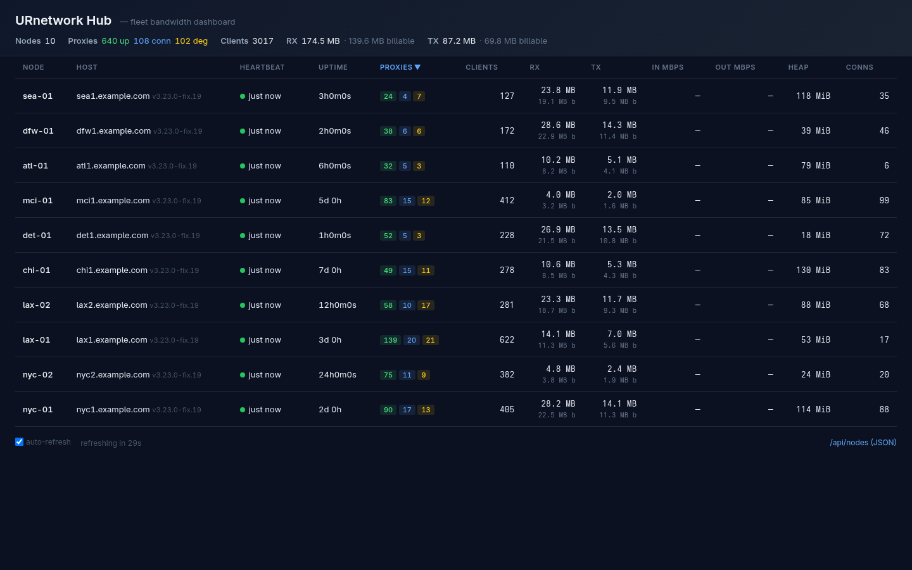

# 📊 Bandwidth Hub Dashboard



A live fleet monitoring dashboard that aggregates bandwidth reports from all provider nodes. The hub runs as a standalone binary, accepts periodic POSTs to `/api/report`, and renders an HTML dashboard at the root path.

## Architecture

```
┌─────────┐   POST /api/report (every 5-15m) ┌─────────┐
│ Provider│  POST /api/heartbeat (every 15s)  │  Hub    │
│  (node) │ ────────────────────────────────▶ │ :8080   │
│         │                                    │ :8443   │
│         │  ┌── HTTPS (TLS with cert pin) ──┐ │ (TLS)   │
└─────────┘  └──────────────────────────────┘ └─────────┘
                                                     │
                                      ┌──────────────┼──────────────┐
                                      ▼              ▼              ▼
                               ┌────────────┐ ┌──────────┐ ┌──────────────┐
                               │  hub.db    │ │ In-memory│ │ GET /api/    │
                               │  (SQLite:  │ │ node map │ │ events (SSE) │
                               │   history) │ │ (no DB   │ │ → dashboard  │
                               └────────────┘ │  writes) │ └──────────────┘
                                              └──────────┘
```

Each provider sends a bandwidth report containing per-proxy traffic counters, health status, and system metrics. The hub keeps the latest state from each node in an in-memory cache (used to render the dashboard and compute delta-based traffic rates between consecutive reports) and persists to a SQLite database, `hub.db`, in WAL mode.

Persistence is two-tier:

- **`proxy_snapshots`** — one gzip-compressed snapshot of each node's full proxy list per report, retained 7 days. Compression shrinks a large proxy list by roughly an order of magnitude.
- **`node_hourly`** — a small per-node, per-hour rollup (cumulative RX/TX, billable, peak clients, sample count), retained 365 days for long-range history.

On startup the hub rebuilds its in-memory cache from the latest stored snapshot of each node, so a restart doesn't blank the dashboard. A legacy `hub.json` from an older build is migrated into `hub.db` once on first boot, then retired to `hub.json.imported`.

In addition to the full report endpoint, providers can send lightweight **heartbeats** to `/api/heartbeat` every 15 seconds (configurable via `HEARTBEAT_INTERVAL`). Heartbeats carry Mbps rates, client/connection counts, contract stats, and memory — all updated in-memory only with **zero DB writes**. The dashboard re-fetches instantly when an SSE push arrives via `GET /api/events`.

Historical rollups are queryable at `/api/history` (params: `node` for a single node, `hours` for the lookback window; defaults to all nodes over 24h).

## Quick Start

### Option A: urnet-tools (native Linux installs, recommended)

If you installed via `urnet-tools`, the hub binary is bundled in the same release. One command installs and starts it as a systemd user service:

```sh
# Install hub as a systemd user service (downloads binary, enables on startup)
urnet-tools hub install

# Point the provider on this machine at the hub
urnet-tools hub set http://localhost:8080

# Point providers on other machines at this hub
urnet-tools hub set http://192.0.2.10:8080
# or with a domain name / HTTPS reverse proxy:
urnet-tools hub set https://hub.yourdomain.com
```

To stop hub reporting without uninstalling anything:

```sh
urnet-tools hub off
```

Stream the hub's own logs:

```sh
journalctl --user -fu urnetwork-hub.service
```

> [!NOTE]
> `hub install` writes a systemd drop-in that persists across reboots. The hub database lives at `~/.local/share/urnetwork-hub/hub.db`.

> [!WARNING]
> **Port 8080 conflict with `ENABLE_VNSTAT`.** The hub defaults to `:8080` (bare-metal `hub install` hardcodes `-addr :8080` with no port flag; Docker's `hub install --docker` and `docker run` default to `-p 8080:8080`). The provider's own `ENABLE_VNSTAT=true` traffic page (on by default in the Docker images) also binds container port 8080. If you colocate a provider and the hub **on the same host**, whichever starts second fails to bind and won't come up.
>
> Fix — remap one of the two:
> - Docker hub: `urnet-tools hub install --docker --port 8081` (or `docker run -p 8081:8080 ...`)
> - Docker provider: publish vnstat on a different host port, e.g. `-p 8081:8080`, or set `ENABLE_VNSTAT=false` if you don't need it on that node
> - Bare-metal hub: no install-time flag exists yet — use a systemd drop-in so the override survives a future `hub install` re-run (which regenerates the unit file):
>   ```sh
>   systemctl --user edit urnetwork-hub.service
>   ```
>   In the editor, add (matching the binary and data paths from the generated unit — check `systemctl --user cat urnetwork-hub.service` if yours differ):
>   ```ini
>   [Service]
>   ExecStart=
>   ExecStart=%h/.local/share/urnetwork-provider/bin/urnetwork-hub -addr :8081 -data %h/.local/share/urnetwork-hub
>   ```
>   Then `systemctl --user daemon-reload && systemctl --user restart urnetwork-hub.service` (and use `:8081` in every `hub set`/`hub link` afterward)
>
> Providers and the hub on separate hosts are unaffected — this only bites when they share a machine.

#### TLS Hub Setup (Built-in HTTPS)

The hub has built-in TLS with self-signed cert and trust-on-first-use pinning — no reverse proxy needed:

```sh
# Enable TLS on the hub (restarts it with HTTPS on :8443)
urnet-tools hub init

# Get the fingerprint (also printed by hub init) and pin it on a remote provider
urnet-tools hub test https://HUB_IP:8443    # verify TLS works

# From the provider machine, pin the hub's cert and point reports at it
urnet-tools hub link https://HUB_IP:8443
```

The hub auto-generates an ECDSA P-256 cert on first boot with TLS enabled. The provider stores the pinned SHA-256 fingerprint in `~/.urnetwork/hub.pin` and verifies it on every connection. Mismatch = connection refused + debug info written to `/tmp/hub-tls-debug.txt`.

---

### Option B: Docker (Windows / Mac / any host)

For hosts without systemd — Windows, macOS, or a Linux box where you'd rather not run a user service:

```sh
docker build -f hub/Dockerfile -t urnetwork-hub .
docker run -d --name urnetwork-hub -p 8080:8080 -v hubdata:/data urnetwork-hub
```

See [Hub-Setup.md](Hub-Setup.md#running-the-hub-in-docker-windows--mac--any-host) for the full walkthrough, including enabling TLS in-container.

### Option C: Build & Run Manually

```sh
# Build from source
cd hub && go build -o hub .

# Run (default :8080, data in current dir)
./hub

# Custom port and data path
./hub -addr :9090 -data /var/hub-data
```

### Configure Providers to Report

Set the `URNETWORK_REPORT_URL` environment variable on each provider at startup, or use the `report` command to set or change it at runtime.

**Startup (Docker):**

```sh
docker run -d \
  --name=urfix \
  -e URNETWORK_AUTH_CODE=YOUR_CODE \
  -e URNETWORK_REPORT_URL=http://HUB_IP:8080 \
  ghcr.io/full-bars/urnetwork-3.23-fix:latest
```

**Startup (native binary):**

```sh
URNETWORK_REPORT_URL=http://HUB_IP:8080 ./ur-provider
```

**Runtime (binary -- no restart):**

```sh
# Set or change the report URL
urnet-tools report http://HUB_IP:8080

# Check current URL
urnet-tools report

# Disable reporting
urnet-tools report off
```

The `report` command writes to `~/.urnetwork/report_url`, which the provider re-reads on every reporter tick (default 5m). No restart needed.

**Runtime (Docker -- no restart):**

The `urnet-tools.ps1` PowerShell wrapper executes these commands inside the container via `docker exec`:

```powershell
# Set or change
urnet-tools report http://HUB_IP:8080

# Check current
urnet-tools report

# Disable
urnet-tools report off
```

The PowerShell wrapper handles the `docker exec` transparently -- it writes `~/.urnetwork/report_url` inside the container. The provider picks it up on the next tick. No container restart needed.

> [!TIP]
> Use a single hub instance for your entire fleet. All nodes report to the same URL.

## Secure Deployment

The hub supports two approaches for encrypted reporting:

### Built-in TLS (No Reverse Proxy Needed)

The hub has a built-in TLS listener on `:8443` with auto-generated self-signed ECDSA P-256 cert. Providers pin the cert fingerprint via `urnet-tools hub link https://HUB_IP:8443`. Best for deployments inside a trusted network (e.g., VPN between fleet nodes).

### Reverse Proxy (For Public-Facing Hubs)

> [!TIP]
> If your nodes are distributed across different networks, it is highly recommended to deploy the Hub behind a reverse proxy like [Caddy](https://caddyserver.com/). This provides automatic HTTPS (SSL/TLS) and allows you to use a clean Domain or DDNS URL.

**1. Caddyfile Configuration**
Create or update your `Caddyfile` to route your domain to the local Hub instance (running on port 8080 by default):

```caddyfile
hub.yourdomain.com {
    reverse_proxy localhost:8080
}
```

**2. Node Configuration**
Configure your provider nodes to report to your new secure URL instead of the raw IP:

```sh
# Docker setup
-e URNETWORK_REPORT_URL=https://hub.yourdomain.com \

# Native binary setup
URNETWORK_REPORT_URL=https://hub.yourdomain.com ./ur-provider
```

## Dashboard Features

### Summary Cards

Five visual cards at the top of the dashboard:

- **Total Proxies** — fleet-wide proxy count across all nodes
- **Healthy** — proxies currently in "up" status with percentage of fleet
- **Degraded** — proxies that were up but are now offline, plus dead count
- **Earning** — percentage of up proxies currently generating billable traffic
- **Active Clients** — total active sessions with aggregate RX/TX

### Fleet Chart

A compact sparkline chart at the top of the Nodes tab shows aggregate RX/TX across the entire fleet for the last 24 hours. Loaded once on page load.

### Filter Bar

Filter nodes by name (text search) and status (All / Healthy / Degraded / Dead) with real-time DOM filtering.

### Node Table

| Column | Description |
|--------|-------------|
| Node | Node ID (name) with version, colored heartbeat dot (pulses when live) |
| Source IP | Color-coded badge showing the node's source IP; same IP = same color, so same-NAT boxes cluster visually |
| TLS | Green padlock icon if the node reported over HTTPS; blank for HTTP |
| Heartbeat | Time since last report, with green/yellow/red health dot |
| Uptime | Provider uptime |
| Proxies | Color-coded status badges (up/degraded/dead) |
| Clients | Active client sessions on this node |
| Earning | Count of this node's proxies currently earning over up proxies |
| RX/TX/Bill RX/Bill TX | Traffic volume with billable breakdown |
| In/Out Mbps | Current bandwidth rate |

Click any node row to open a slide-out drawer showing the full per-proxy detail list (ID, address, status, clients, age, traffic).

### History Tab

Time series chart showing RX/TX over the last 24 hours, 3 days, or 7 days. Filter by individual node or view fleet aggregate. Reset zoom button restores the default range.

### Performance

The hub dashboard is optimized to handle large fleets efficiently:
- **Gzip compression** — all HTTP responses are gzip-compressed (HTML, JSON)
- **Lazy proxy loading** — proxy details are fetched on demand via `/api/nodes/<id>/proxies` rather than embedded inline
- **JSON-only auto-refresh** — the 30-second auto-refresh fetches lightweight node metadata via `/api/nodes` and updates the DOM in place; also triggered immediately by SSE push from `GET /api/events` when reports or heartbeats land
- **Rate limiting** — per-IP rate limiter (60 req/min) protects against accidental or malicious request floods; `/api/report` is exempt so provider reports are never blocked
- **Stale node eviction** — nodes that haven't reported in 15 minutes are automatically removed from the in-memory dashboard; they reappear when they report again
- **History query safety** — history queries are capped at 7 days (168 hours) and 10,000 rows |
| RX | Total received bytes / billable received (smaller text) |
| TX | Total transmitted bytes / billable transmitted |
| In Mbps | Inbound traffic rate (delta-based) |
| Out Mbps | Outbound traffic rate (delta-based) |
| Heap | Go heap memory (MiB) |
| Conns | Active network connections |

- **Sortable**: Click any column header to sort ascending/descending
- **Sort indicator**: ▼ (descending) or ▲ (ascending) arrow in the active sort column
- **Default sort**: By proxy count (highest first)

### Per-Proxy Drilldown

Click any node row to expand its full proxy list:

- **ID** — proxy identifier and address
- **Address** — IP:port
- **Status** — up / connecting / degraded. A proxy stays `connecting` while its first WebSocket is still being established; if it never connects, the connecting state expires after one pulse cycle (~65 minutes) and the proxy falls back to a degraded tier, so a hung respawn is distinguishable from a fresh one.
- **Earning** — `Yes`/`No` badge; `Yes` when this proxy's billable bytes grew since the previous report **and** it currently has active clients (mirrors the provider's `[traffic]`/`[profit]` earning signal)
- **Clients** — active sessions on this proxy
- **Max Age** — longest-running connection
- **RX** — total received bytes
- **TX** — total transmitted bytes
- **Bill RX** — billable received bytes
- **Bill TX** — billable transmitted bytes

Click the expanded row again to collapse.

### Live Updates via SSE

The dashboard subscribes to `GET /api/events` via the `EventSource` API. The hub pushes a `data: refresh` signal the instant a heartbeat or report lands, so the dashboard re-fetches node metadata immediately — no need to wait for the poll timer. A 30-second periodic poll stays active as a fallback for proxies or networks that buffer or strip SSE.

### JSON API

For external tooling:

```sh
curl http://HUB_IP:8080/api/nodes             # full node state as JSON
curl -sN http://HUB_IP:8080/api/events        # SSE stream (data: refresh on updates)
```

`/api/nodes` returns the full node state as JSON, including all proxy details, system metrics, and a `tls` field indicating whether the last report arrived over HTTPS.

Heartbeats from providers are sent to `/api/heartbeat` (POST). The heartbeat carries the same `node_id` as the report and includes `mbps_rx`, `mbps_tx`, `clients`, contract counts, and per-proxy status changes — all updated in-memory without touching the database.

## Report Format

Providers POST to `/api/report` with this structure:

```json
{
  "node_id": "vegas",
  "host": "vegas.example.com",
  "version": "v3.23.0-fix.19",
  "uptime": 3600.0,
  "proxies": [
    {
      "id": "proxy[0] (192.168.1.1:1080)",
      "addr": "192.168.1.1:1080",
      "status": "up",
      "rx": 1024000,
      "tx": 512000,
      "bill_rx": 900000,
      "bill_tx": 400000,
      "clients": 3,
      "max_age_s": 120
    }
  ],
  "sys": {
    "heap_mib": 64,
    "sys_mib": 128,
    "conns": 42
  }
}
```

## Rate Tracking

The hub computes per-node traffic rates as:

```
mbps = (current_bytes - previous_bytes) / elapsed_seconds × 8 / 1_000_000
```

Rates are shown in the **In Mbps** and **Out Mbps** columns. A node needs at least two reports at least one second apart to show a rate.

## Billable vs Total Traffic

Each proxy report carries both `rx`/`tx` (total wire bytes) and `bill_rx`/`bill_tx` (billable bytes). The dashboard distinguishes them:

- **Summary bar**: `RX 1.3 GB · 1.2 GB billable`
- **Node rows**: Total on top, billable below in muted text with `b` suffix
- **Proxy detail**: Separate columns for Bill RX and Bill TX

This lets you see at a glance how much traffic is revenue-generating vs. total wire overhead.

## Troubleshooting

| Symptom | Likely Cause |
|---------|-------------|
| Node shows "—" for rates | Only one report received; wait for the next report cycle |
| Node shows red dot | No report received in >5 minutes |
| Dashboard shows stale data | Provider process may be down or `URNETWORK_REPORT_URL` is misconfigured |
| TLS padlock shows for some nodes but not others | Those nodes report to the HTTP port instead of HTTPS; run `urnet-tools hub link https://HUB_IP:8443` on the provider |
| Hub TLS link fails with "fingerprint mismatch" | The hub cert was regenerated (e.g., hub restart after cert file loss). Run `hub test` to inspect the new fingerprint, then `hub link` again to re-pin |
| No proxies in drilldown | Provider sent empty proxy list; check provider logs |
| "b" shows 0 B for billable | Proxy did not report billable bytes (may be in warmup state) |

## Data Storage

The hub persists to a SQLite database, `hub.db`, in the configured `-data` directory (WAL mode, so `hub.db-wal` and `hub.db-shm` sidecar files are normal). It can be inspected with any SQLite tool or backed up while the hub runs.

```sh
# Count reporting nodes
sqlite3 /var/hub-data/hub.db "SELECT COUNT(*) FROM nodes;"

# Latest per-node rollup totals
sqlite3 -header -column /var/hub-data/hub.db \
  "SELECT node_id, total_rx, total_tx, peak_clients FROM node_hourly ORDER BY hour DESC LIMIT 20;"

# Or fetch history over the API (last 7 days for one node)
curl -s 'http://localhost:8080/api/history?node=la6&hours=168' | jq .
```

Retention is automatic: `proxy_snapshots` are pruned after 7 days (hourly), `node_hourly` rollups after 365 days (daily).
